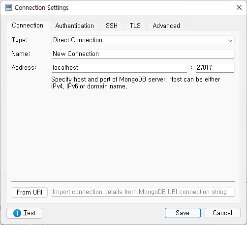
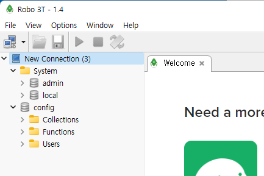
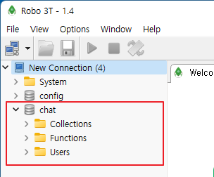
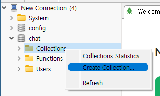
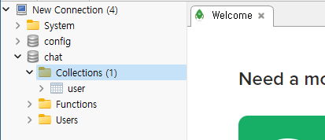
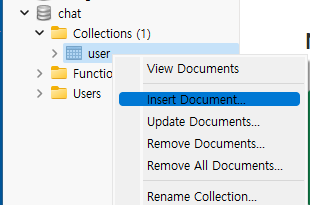
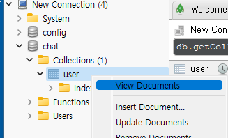
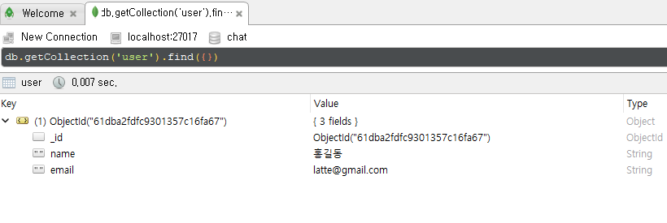

# MongoDB (2)  MongoDB 접속 툴 설치

RobotoMongo를 다운로드 받아 설치한다. 
[RoboMongo](https://robomongo.org/download)





연결하면 다음과 같은 화면을 볼 수 있다. 





Newe Connection을 선택하고 우측 마우스 버튼 클릭한 다음에 "Create Databse"를 선택한다. 

Database Name에 "chat"를 입력한다. chat'이라는 DB가 생성된 것을 알 수 있다. 





## 콜렉션(Collection) 생성 

Collections이라는 것은 DB의 테이블과 비슷하다. 그러나 몽고DB는 스키마를 정의하지 않는다. 

chat DB의 Collections을 선택하고 우측마우스 버튼을 클릭한 다음에 "Create Collection"을 선택한다. 




"Create Collection" 창에서 Collection Name에 'user'를 입력한다.  user collection이 생성된 것을 볼 수 있다. 




## 데이터 입력 
Insert Document를 선택한다. 


json 구조에 맞게 데이터를 입력한다. 
```json
{
    name: "홍길동",
    email: "latte@gmail.com"
}
```
Double quotation("")으로 감싸지 않는다. 


## 데이터 조회 
View Document를 선택한다. 






